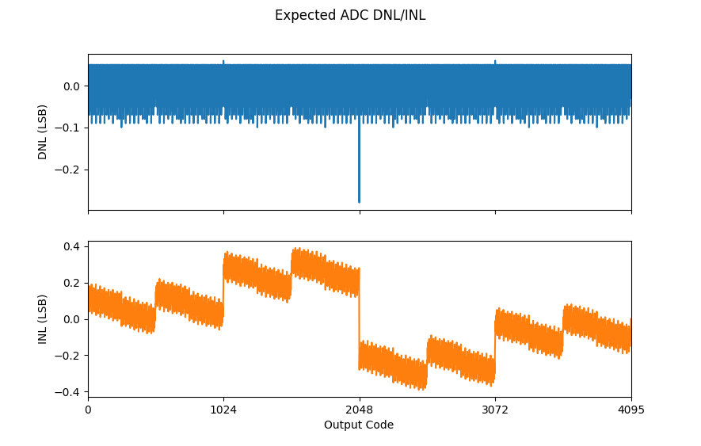

# 12 bit SAR ADC
**Author:** Ricardo Nunes, www.linkedin.com/in/rnunes2311

This is a 12 bit SAR ADC designed using open source tools in the Skywater 130 nm PDK.
The ADC can be configured as differential (12 bit) or single-ended (11 bit). The comparator has offset self-calibration implemented, which can be enabled using an input pin.

## Current Status

|Stage					|Status		|Comment									|
|-----------------------|-----------|-------------------------------------------|
|Schematic				|✅			|											|
|State Machine			|✅			|											|
|Verification			|❌			|Working on it!								|
|Layout					|✅			|Layout done, TinyTapeout template missing	|
|DRC & LVS				|✅			|DRC & LVS clean							|
|TinyTapeout Submission	|❌			|Target: 1st of June						|

## Theory
**Topics:**
- Binary search algorithm
- IMCS switching scheme
- Comparator common-mode voltage requirements
- Capacitive DAC
- Bottom plate sampling
- Noise

### Waveforms from Simulation

## Pinout

|Name			|Direction		|Type		|Description																					|
|---------------|---------------|-----------|-----------------------------------------------------------------------------------------------|
|VDD			|Input			|Supply		|1.8 V supply input.																			|
|VSS			|Input			|Supply		|Ground.																						|
|VREF			|Input			|Analog		|1.2 V reference voltage.																		|
|VREF_GND		|Input			|Analog		|Reference voltage ground.																		|
|VCM			|Input			|Analog		|0.6 V common-mode voltage.																		|
|VIN_P			|Input			|Analog		|Positive input signal.																			|
|VIN_N			|Input			|Analog		|Negative input signal.																			|
|CLK			|Input			|Digital	|Clock input.																					|
|RST_Z			|Input			|Digital	|Enable input.																					|
|START			|Input			|Digital	|Start conversion input. Keep high to convert continuously.										|
|EN_OFFSET_CAL	|Input			|Digital	|Enables comparator offset self-calibration.													|
|SINGLE_ENDED	|Input			|Digital	|Configures ADC for single-ended input and VIN_N is used as ground reference.					|
|CLK_DATA		|Output			|Digital	|Rising edge used to sample the 6 MSBs and falling edge used for the 6 LSBs of ADC output. 		|
|DATA[5:0]		|Output			|Digital	|Result of the conversion.																		|

## Specification

|Parameter									|Min		|Typical			|Max	|Unit	|
|-------------------------------------------|-----------|-------------------|-------|-------|
|Supply Voltage								|1.7		|1.8				|1.9	|V		|
|Power Consumption							|			|					|		|µA		|
|Temperature								|0			|27					|85		|ºC		|
|Reference Voltage							|1.15		|1.2				|1.25	|V		|
|Input Common Mode Voltage (differential)⁶	|0.5		|0.6				|0.7	|V		|
|Ground Reference Voltage (single-ended)	|-0.1		|0					|0.1	|V		|
|Output resistance for analog inputs		|			|					|500	|Ω		|
|Clock Frequency¹							|			|					|20		|MHz	|
|Clock Low Pulse Width²						|10			|					|		|ns		|
|Sampling Frequency							|			|1/16 of clock freq.|		|		|
|Sampling Capacitance						|			|~ 4.1				|		|pF		|
|INL³										|			|					|		|LSB	|
|DNL³										|			|					|		|LSB	|
|ENOB without noise⁴						|			|					|		|bit	|
|ENOB with noise⁴𝄒⁵							|			|					|		|bit	|
|SNDR without noise⁴						|			|					|		|dB		|
|SNDR with noise⁴𝄒⁵							|			|					|		|dB		|
|SFDR⁴										|			|					|		|dB		|

¹ Input signal is sampled for 2 clock cycles. Clock/sampling frequency is limited by the 500 Ω resistance from the pads to the circuit in the TinyTapeout IC.\
² Clock falling edge triggers the latched comparator, therefore clock low pulse width has to be larger than latched comparator propagation delay.\
³ Typical values for INL/DNL based on C extraction. Mismatch is not included.\
⁴ SNDR/ENOB do not include distortion introduced by TinyTapeout analog MUX.\
⁵ Noise estimated, not obtained directly from simulation.\
⁶ Both 2*VIN(CM)-VCM and VCM should respect the limits to ensure comparator input common-mode voltage range is respected.

**TODO**

## Verification
Top level was verified for the following conditions:

|Corner						|Supply Voltage		|Common-mode Voltage	|Temperature	|Status	|
|---------------------------|-------------------|-----------------------|---------------|-------|
|Nominal					|1.8 V				|0.6 V					|27 ºC			|✅		|
|Nominal, C extraction		|1.8 V				|0.6 V					|27 ºC			|✅		|
|Nominal, RC extraction		|1.8 V				|0.6 V					|27 ºC			|❌		|
|FETs ff, RC low			|1.7 V				|0.5 V					|0 ºC			|⚠️¹	|
|FETs ff, RC low			|1.7 V				|0.5 V					|85 ºC			|⚠️¹	|
|FETs ff, RC low			|1.7 V				|0.7 V					|0 ºC			|✅		|
|FETs ff, RC low			|1.7 V				|0.7 V					|85 ºC			|✅		|
|FETs ff, RC low			|1.9 V				|0.5 V					|0 ºC			|✅		|
|FETs ff, RC low			|1.9 V				|0.5 V					|85 ºC			|✅		|
|FETs ff, RC low			|1.9 V				|0.7 V					|0 ºC			|✅		|
|FETs ff, RC low			|1.9 V				|0.7 V					|85 ºC			|✅		|
|FETs ss, RC high			|1.7 V				|0.5 V					|0 ºC			|✅		|
|FETs ss, RC high			|1.7 V				|0.5 V					|85 ºC			|✅		|
|FETs ss, RC high			|1.7 V				|0.7 V					|0 ºC			|✅		|
|FETs ss, RC high			|1.7 V				|0.7 V					|85 ºC			|❌		|
|FETs ss, RC high			|1.9 V				|0.5 V					|0 ºC			|❌		|
|FETs ss, RC high			|1.9 V				|0.5 V					|85 ºC			|❌		|
|FETs ss, RC high			|1.9 V				|0.7 V					|0 ºC			|❌		|
|FETs ss, RC high			|1.9 V				|0.7 V					|85 ºC			|❌		|

¹ VDAC_P (or VDAC_N) = 2*VCM-VIN_P (or VIN_N) during the determination of the MSB. If VIN_P (or VIN_N) > 2*VCM, VDAC_P (or VDAC_N) goes below 0 V, causing the charge in the S&H capacitor not to be conserved either because of parasitic PN junction between top plate switch (drain/source) and substrate being slightly forward biased or NMOS transistor being slightly switched on. See appendix 1 for detailed results.

### DNL/INL
The DNL and INL were estimated by extracting all the DAC capacitors (MIM and parasitic metal capacitances) from the C extraction netlist.
A python script reads the netlist file, extracts all the relevant capacitances and simulates the output of the ADC for a sweep of the input signal in order to calculate the DNL and INL. The results can be seen in the figure below.

## Validation Results
**TODO**